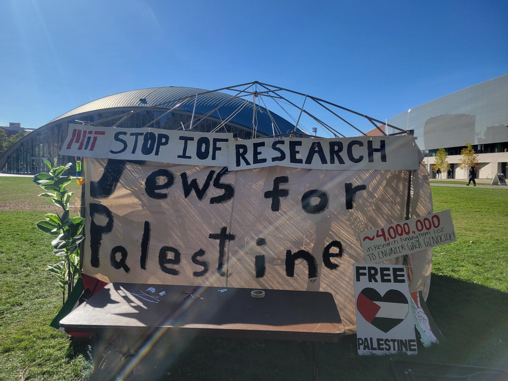
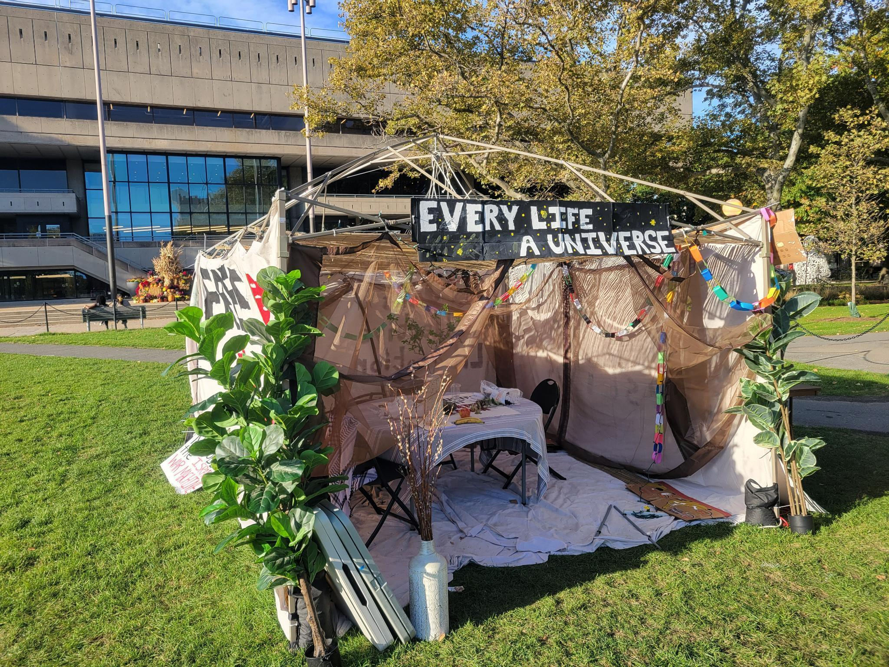
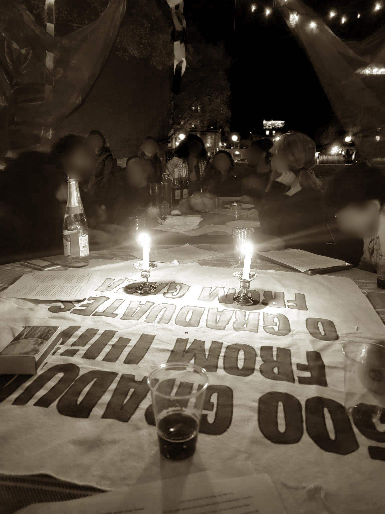

Five months after the [4 AM police raid](https://docs.google.com/document/d/e/2PACX-1vSxjiDn4TPPaHEPhZjwP1-ZBZhUeZ7mNyHpI-PUag2GCJlLYe2a9naj3JTUUqbAbvJ38JhGsCtu-n32/pub) on the sleeping students of [Students Against Genocide Encampment](http://mitsage.org/) (MIT SAGE), we made our way back to Kresge with another tent. On October 16th, the [MIT Jews for Collective Liberation](http://jcl.mit.edu/) (JCL) erected a sukkah to mark Sukkot during the 12th month of Israel’s horrific genocide. In this letter, we want to explain what Sukkot is, why we chose to build our sukkah on Kresge, and why doing so is consistent with our Jewish traditions. We close by asking the MIT administration and faculty to end collaboration with Israel’s Ministry of Defense and war profiteers.

## What is Sukkot?

Sukkot is a Jewish holiday that celebrates the Israelites’ forty years of wandering the desert after being forced out of Egypt. We see Sukkot as an enduring metaphor for displaced peoples across the world — it is a metaphor that makes the displacement of two million people in Gaza, one million people in Lebanon, and the bombing of tent-sheltering refugees in Khan Younis and Jabalia ([including 19 year old Sha’ban who was still strapped to an IV in his medical tent, along with his mother sleeping beside him](https://www.democracynow.org/2024/10/18/sha_ban_al_dalou)) difficult to ignore. During Sukkot, we erect a temporary shelter with a slat-covered ceiling called a sukkah. We hand-built our sukkah on Kresge using found materials in order to bypass the $1,000 it would cost for the engineering review that MIT tried to impose, and covered it with pro-Palestine and liberatory messaging (see photos).

Though some people view Sukkot as a zionist holiday, we argue that this perspective is a perversion of the holiday’s original meaning: zionism is a modern ideology (around 150 years old in Jewish circles) while Sukkot is thousands of years old — it predates the modern idea of the nation-state. Though Sukkot’s relationship to the land of Israel has been warped and narrowed to mean the zionist conception of a Jewish supremacist nation-state, for most of its history the holiday was a love letter to the _land itself_, distinct from the segregationist, war-mongering politics of the present day. In Hebrew, the term is _Eretz_ (land of) Yisrael, not _Medinat_ (state of) Yisrael.

## Why was our sukkah on Kresge?

Since November of last year, we have been speaking out in every available medium (protest, flyering, media, and many emails) to implore MIT administration and faculty to divest from the ongoing genocide — divest from the Israeli Ministry of Defense funding its research projects[^1] and sunset the Elbit and Maersk partnerships in ILP. But to our collective sorrow, we are one year into the genocide and MIT has refused to reckon with the relationships that tie it to the horrifying realities of industrialized killing. No crisis of conscience, no willingness to give a second thought to what funds our research programs or to what that research supports. 200,000 people are dead[^2] with the aid of [drone warfare](https://www.forbes.com/sites/davidhambling/2021/07/21/israels-combat-proven-drone-swarm-is-more-than-just-a-drone-swarm/?sh=64dce93a1425) and the help of weapons shipper Maersk and weapons builder Elbit. Yet MIT carries on unchanged, allowing its drone research for the Israeli Ministry of Defense and partnerships with these complicit firms to continue.

We built our sukkah as a silent protest of MIT’s continued participation in Israel’s bloodthirsty regime. Though our sukkah served as a place of contemplation and community for its occupants and visitors over eight days,[^3] its canvas walls were painted with messages denouncing MIT’s collaboration with a government that has engaged in apartheid, and genocide, and that is now pursuing the complete extermination of the Palestinian people. With this sukkah, our message remains the same: as Jewish students, faculty, and staff, we will not stop fighting until MIT ends its complicity in the war crimes which Israel claims are carried out on our behalf. We will not stop shouting ‘not in our name’, and ‘never again for anyone.’ We will not stop standing with our friends and allies who call for Palestinian liberation, from the river to the sea.

## Is this for the “betterment of humankind”?[^4]

MIT is invested in Israel’s war machine, propping up its weapons manufacturing through research projects funded by the Israeli Ministry of Defense and ILP collaborations with war profiteers like Elbit and Maersk. We believe that supporting the Israeli government and its arms dealers is morally bankrupt. These entities are together responsible for the massacre of hundreds of thousands of people (in a region with a population that is over 50% children[^5]); they have starved and displaced more than two million people; they subject the people of Gaza to the daily tyrannies of manufactured disease, dehumanization, and intentional deprivation, with more reprehensible cruelty revealed each day. The MIT administration and faculty’s refusal to reconsider existing arrangements during a year-long crisis makes us sick. We should be able to expect more from our institutions, from MIT. We should be better than this, as human beings.

On Sukkot, we commemorated our ties to the land, building a temporary shelter to remember how fragile and sacred those ties are. We built our sukkah to insist that it is our obligation to fight for an end to the Israeli state’s war — its genocide, its ongoing apartheid, and its brutal attempts to sever the Palestinian people from their land.

If you want to join us, [fill out our interest form](https://forms.gle/QZdykgMHNsCYk3gt6).

With hope,\
MIT Jews for Collective Liberation

[^1]: See Professor Eytan Modiano’s “Autonomous Robotic Swarms” and Professor Daniela Rus’s “Coreset Compression Algorithms” as two examples. The full list of projects as of last year can [be found here](https://docs.google.com/spreadsheets/d/1Q13sdsOQsxTtkqG-lebja5l-6-Oy8ERVhF1-JjOe8G8/edit?gid=0#gid=0).

[^2]: Back in July, The Lancet (a peer-reviewed medical journal) published a conservative estimate of [186,000 dead](<https://www.thelancet.com/journals/lancet/article/PIIS0140-6736(24)01169-3/fulltext>).

[^3]: We held many wonderful events over those eight days including Sukkot ceremonies, dinners, Shabbat, a mutual aid discussion, a vigil for Jabalia, a Klezmer concert and fundraiser for a family in Gaza, and a Kashmiri liberation workshop (because we are all connected in our struggles for liberation).

[^4]: From the [MIT mission statement](https://www.mit.edu/about/mission-statement/).

[^5]: When we printed out the names of just the babies that never saw their first birthday at the time of their murder, it took us fifteen double-sided pages. But this was a steep undercount. For more accurate numbers, see the peer reviewed article published in [The Lancet](<https://www.thelancet.com/journals/lancet/article/PIIS0140-6736(24)01169-3/fulltext>).
